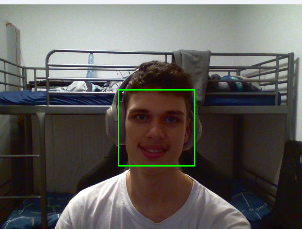

# Face Tracking
___
**[Link to cascades]( https://github.com/opencv/opencv/blob/4.x/data/haarcascades/haarcascade_frontalface_default.xml)**
___


___
**Source Code**

```python
import cv2

face_cascades = cv2.CascadeClassifier(cv2.data.haarcascades+"haarcascade_frontalface_default.xml")

cap = cv2.VideoCapture(0)

while True:
    success, img = cap.read()

    filter_gray = cv2.cvtColor(img, cv2.COLOR_BGR2GRAY)

    faces = face_cascades.detectMultiScale(filter_gray, 1.1, 19)

    for (x, y, w, h) in faces:
        cv2.rectangle(img, (x, y), (x+w, y+h), (0,255,0), 2)

    cv2.imshow('Res', img)
    if cv2.waitKey(1) & 0xff == ord('q'):
        break
cap.read()
cv2.destroyAllWindows()
```
___
# Run File webcam.py
**If you want exit press q**